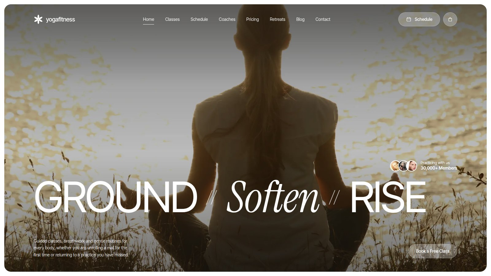

# Yoga Fitness

A calm, editorial yoga & wellness studio theme for [Astro](https://astro.build). One rich home page — classes, timetable, coaches, memberships, retreats and more — plus a real blog, a contact page and a custom 404. Static output, almost no JavaScript, and every piece of content lives in small data files you can edit without touching the components.



## Demo

**[yoga-fitness-seven.vercel.app](https://yoga-fitness-seven.vercel.app/)**

## Features

- **Astro 7**, static output, no UI framework
- Calm, premium yoga/wellness design with an editorial serif + sans type pairing
- Responsive layout from 320px phones to wide desktops
- Home page sections: hero, approach, classes, interactive practice focus (tabs + image hotspots), weekly schedule, coaches, first-visit steps, memberships with monthly/yearly toggle, member stories slider, gallery, retreats & workshops, FAQ, latest posts, newsletter and a contact call-to-action
- Blog powered by an Astro content collection: index with featured post, article pages with breadcrumbs, metadata, tags and related posts
- Contact page with studio details, opening hours, social links, a location card and a static, provider-ready contact form
- Custom 404 page
- Accessible navigation: skip link, `aria-current`, keyboard-operable mobile menu (Escape closes, focus returns), ARIA tabs with arrow-key support, labelled controls, visible focus styles
- `prefers-reduced-motion` support and graceful no-JavaScript fallbacks (all schedule days listed, menu visible, FAQ works via `<details>`)
- SEO component: titles, descriptions, canonical URLs, Open Graph, X/Twitter cards
- JSON-LD structured data (WebSite, HealthAndBeautyBusiness, BlogPosting, BreadcrumbList)
- Sitemap (`@astrojs/sitemap`), `robots.txt` and an RSS feed for the blog
- Self-hosted fonts via the Astro Fonts API (preloaded, with metric-matched fallbacks)
- Custom SVG icon sprite and flower monogram logo (also used for the favicon)
- Local, pre-optimized WebP images with explicit dimensions; hero prioritized, everything below the fold lazy-loaded
- Centralized configuration in `src/config/site.ts` and `src/data/*.ts`
- Sub-path deploys (e.g. GitHub Pages project sites) via a single env var

## Tech stack

| | |
|---|---|
| Framework | [Astro](https://astro.build) 7 (static output) |
| Language | TypeScript (data, config, scripts) |
| Styling | Plain CSS with design tokens (no CSS framework) |
| Interactivity | Small vanilla TypeScript `<script>`s, bundled and inlined by Astro |
| Integrations | `@astrojs/sitemap`, `@astrojs/rss` |
| Dev tooling | `@astrojs/check`, `typescript` |

## Requirements

- **Node.js 22.12.0 or newer** (required by Astro 7). An `.nvmrc` is included.
- npm 9.6.5+ (or pnpm / yarn)

## Installation

```bash
git clone https://github.com/Scintillaweb/Yoga-Fitness.git
cd Yoga-Fitness
npm install
```

## Development

```bash
npm run dev
```

Open http://localhost:4321.

## Build

```bash
npm run build
```

The static site is written to `dist/`.

## Preview

```bash
npm run preview
```

Serves the production build locally.

## Type check

```bash
npm run check
```

## Project structure

```text
├── astro.config.mjs        Site URL, base path, sitemap, fonts
├── public/
│   ├── favicon.svg         Flower monogram favicon
│   ├── og-default.jpg      Default social sharing image (1200×630)
│   └── images/             All photography (WebP)
├── docs/featured.jpg       Featured image for README and the Astro catalog (not used by the site)
└── src/
    ├── assets/fonts/       Inter Tight + Instrument Serif (WOFF2, OFL)
    ├── components/         Section and UI components
    │   └── icons/IconSprite.astro
    ├── config/site.ts      Studio name, contact, hours, socials, forms, SEO
    ├── content/blog/       Blog posts (Markdown)
    ├── content.config.ts   Blog collection schema
    ├── data/               Home-page content: classes, schedule, coaches, …
    ├── layouts/            BaseLayout, PageLayout, BlogPostLayout
    ├── pages/              /, /contact, /blog, /blog/[slug], 404, rss.xml, robots.txt
    ├── styles/             tokens.css, global.css, components.css, pages.css
    ├── utils/              URL, date, post and structured-data helpers
    └── types.ts            Types for all config and data
```

Only these routes exist: `/`, `/contact`, `/blog`, `/blog/[slug]` and the 404 page. Classes, schedule, coaches, pricing, retreats and FAQ are sections of the home page, linked with `/#classes`, `/#schedule` and so on, so they work from every page.

## Customization

| What | Where |
|---|---|
| Studio name, word mark, tagline, description | `src/config/site.ts` |
| Email, phone, address, opening hours | `src/config/site.ts` → `contact`, `hours` |
| Social links | `src/config/site.ts` → `socials` (icons: `camera`, `play`, `chat`, `globe`, …) |
| SEO defaults, social image, theme color | `src/config/site.ts` → `seo` |
| Production URL | `SITE_URL` env var or the fallback in `astro.config.mjs` |
| Navigation & footer links | `src/data/navigation.ts` |
| Hero, approach, focus areas, first-visit steps, gallery, section titles, CTA | `src/data/home.ts` |
| Classes | `src/data/classes.ts` |
| Weekly schedule | `src/data/schedule.ts` |
| Coaches | `src/data/coaches.ts` |
| Memberships & prices | `src/data/pricing.ts` |
| Member stories | `src/data/testimonials.ts` |
| Retreats & workshops | `src/data/retreats.ts` |
| FAQ | `src/data/faq.ts` |
| Blog posts | `src/content/blog/*.md` |
| Colors, type scale, radii, spacing | `src/styles/tokens.css` |

**Logo.** The flower monogram is the `i-logo` symbol in `src/components/icons/IconSprite.astro`; the word mark comes from `site.logoText`. Update `public/favicon.svg` with the same artwork.

**Colors.** Edit the custom properties in `src/styles/tokens.css` (`--color-ink`, `--color-stone`, `--color-muted`, `--color-line`, `--color-mist`, `--color-sand`, `--color-white`, `--glass`, `--glass-strong`). `--color-muted` is slightly darker than in the original HTML design (`#72706A` instead of `#A3A09A`) so small text meets WCAG AA contrast.

**Typography.** Fonts are declared in `astro.config.mjs` (`fonts`) and used through `--font-sans` / `--font-serif` in `tokens.css`. To switch typefaces, drop new WOFF2 files into `src/assets/fonts/`, update the `fonts` entries, and keep the CSS variable names.

**Hero.** `hero` in `src/data/home.ts`: the headline words (`serif: true` renders a word in italic serif), description, button, image and the member-count badge (remove `proof` to hide it).

**Approach pillars.** `approach.pillars` in `src/data/home.ts` is split in two: the first half is listed left of the image, the rest on the right (they stack on smaller screens).

**Focus hotspots.** Each focus area has `x` / `y` percentages that position its hotspot over the image. Adjust them if you change the photo.

**Schedule.** One entry per day; each class needs `time`, `period`, `className`, `instructor`, `duration` and can take an optional `level` and `bookingUrl`. "Reserve" falls back to `site.bookingUrl`.

**Pricing.** Each plan has `monthlyPrice` and `yearlyPrice`; set `featured: true` for the dark card. Currency and labels are in `pricing`. CTAs default to `/contact`; point `ctaUrl` at your booking or checkout page. No payment system is included.

**Retreats.** Use ISO dates (`2026-11-14`); the card formats them. Point `bookingUrl` at your booking platform.

**Images.** Put files in `public/images/` and reference them as `/images/your-file.webp`. Always write meaningful `alt` text; use `alt: ''` only for decorative images. Recommended sizes: hero 2200×1400, page heroes 2000×1125, class cards 900×720, coaches 720×960, retreats 800×1000, blog 1600×1000.

**Demo mode.** `site.isDemo` keeps the placeholder address and phone number out of the structured data. Set it to `false` once your real details are in place.

## Adding blog posts

Create a Markdown file in `src/content/blog/`. The file name becomes the URL (`my-post.md` → `/blog/my-post/`).

```md
---
title: My New Post
description: One or two sentences used on cards, in search results and social previews.
pubDate: 2026-10-01
category: Breathwork
image: /images/blog-02.webp
imageAlt: Describe the image
author: Sofia Lindqvist   # optional, defaults to "Yoga Fitness Team"
tags: [breathwork, routine]
readingTime: 5            # optional, calculated automatically
draft: false              # drafts show in `npm run dev` only
---

Your content here…
```

Posts are sorted newest first. The latest post is featured on `/blog`, the newest three appear on the home page and related posts are picked by category and shared tags.

## Contact form

The contact form (`src/components/ContactForm.astro`) and the newsletter form are plain HTML forms. **Out of the box they run in demo mode:** input is validated in the browser and a notice explains that nothing was sent. No data leaves the page and no API keys are included.

To connect a provider, set the endpoint in `src/config/site.ts`:

```ts
forms: {
  contactAction: 'https://formspree.io/f/your-form-id',
  newsletterAction: '',
},
```

When an endpoint is set the form submits with `method="post"` and these field names: `name`, `email`, `phone`, `topic`, `message` (plus a hidden `_gotcha` spam honeypot).

- **Formspree** — create a form, paste its endpoint as `contactAction`. `_gotcha` is Formspree's honeypot name.
- **Web3Forms** — use `https://api.web3forms.com/submit` as `contactAction` and add `<input type="hidden" name="access_key" value="YOUR_PUBLIC_KEY">` inside the form. Web3Forms access keys are designed to be public.
- **Netlify Forms** — add `name="contact"` and `data-netlify="true"` to the `<form>` element, add `<input type="hidden" name="form-name" value="contact">`, and set `contactAction` to a thank-you path such as `/contact/`. Optionally add `netlify-honeypot="_gotcha"`.
- **Your own API** — point `contactAction` at an endpoint that accepts `application/x-www-form-urlencoded` POST requests.

The newsletter form works the same way with `newsletterAction` (it sends one field, `email`) — use the form-action URL from your email provider.

## Deployment

Set `SITE_URL` to your production URL (used for canonical links, Open Graph, sitemap and RSS) on whichever host you use, or replace the demo URL fallback in `astro.config.mjs`. See `.env.example`.

- **Vercel** — import the repository; Vercel detects Astro. Build command `npm run build`, output directory `dist`. Add `SITE_URL` under *Environment Variables*.
- **Netlify** — build command `npm run build`, publish directory `dist`. Add `SITE_URL` in *Site configuration › Environment variables*.
- **Cloudflare Pages** — framework preset *Astro*, build command `npm run build`, output directory `dist`. Add `SITE_URL` (and `NODE_VERSION=22` if needed).
- **GitHub Pages** — use the official [withastro/action](https://github.com/withastro/action) workflow (see Astro's [GitHub Pages guide](https://docs.astro.build/en/guides/deploy/github/)). For a project site served from `https://<user>.github.io/<repo>/`, set `SITE_URL=https://<user>.github.io` and `BASE_PATH=/<repo>` as environment variables in the workflow's build step. All internal links and assets respect the base path.
- **Any static host** — run `npm run build` and upload the contents of `dist/`. Configure the host to serve `404.html` for missing pages.

## Images

All photographs were sourced from [pxhere.com](https://pxhere.com), where each photo page states it is released under **CC0 1.0 Public Domain** ("free for personal and commercial use, no attribution required"). The license was checked on every source page before download. The files were cropped, resized and converted to WebP for this theme; `yoga-hero.webp` was also tonally darkened at the top so the navigation stays legible.

Attribution is not required, but sources are listed here for transparency:

| File (`public/images/`) | Source |
|---|---|
| `avatar-01.webp` | [pxhere.com/en/photo/1338081](https://pxhere.com/en/photo/1338081) |
| `avatar-02.webp` | [pxhere.com/en/photo/868153](https://pxhere.com/en/photo/868153) |
| `avatar-03.webp` | [pxhere.com/en/photo/761298](https://pxhere.com/en/photo/761298) |
| `blog-01.webp` | [pxhere.com/en/photo/660599](https://pxhere.com/en/photo/660599) |
| `blog-02.webp` | [pxhere.com/en/photo/1127997](https://pxhere.com/en/photo/1127997) |
| `blog-03.webp` | [pxhere.com/en/photo/1223742](https://pxhere.com/en/photo/1223742) |
| `blog-04.webp` | [pxhere.com/en/photo/1223745](https://pxhere.com/en/photo/1223745) |
| `blog-05.webp` | [pxhere.com/en/photo/956878](https://pxhere.com/en/photo/956878) |
| `blog-06.webp` | [pxhere.com/en/photo/780205](https://pxhere.com/en/photo/780205) |
| `class-breathwork.webp` | [pxhere.com/en/photo/1058656](https://pxhere.com/en/photo/1058656) |
| `class-hatha.webp` | [pxhere.com/en/photo/1067181](https://pxhere.com/en/photo/1067181) |
| `class-power.webp` | [pxhere.com/en/photo/1622675](https://pxhere.com/en/photo/1622675) |
| `class-prenatal.webp` | [pxhere.com/en/photo/711905](https://pxhere.com/en/photo/711905) |
| `class-vinyasa.webp` | [pxhere.com/en/photo/1344475](https://pxhere.com/en/photo/1344475) |
| `class-yin.webp` | [pxhere.com/en/photo/661341](https://pxhere.com/en/photo/661341) |
| `coach-01.webp` | [pxhere.com/en/photo/1622676](https://pxhere.com/en/photo/1622676) |
| `coach-02.webp` | [pxhere.com/en/photo/1391675](https://pxhere.com/en/photo/1391675) |
| `coach-03.webp` | [pxhere.com/en/photo/1064613](https://pxhere.com/en/photo/1064613) |
| `coach-04.webp` | [pxhere.com/en/photo/1094338](https://pxhere.com/en/photo/1094338) |
| `cta-coast.webp` | [pxhere.com/en/photo/7904](https://pxhere.com/en/photo/7904) |
| `focus-seated.webp` | [pxhere.com/en/photo/1084638](https://pxhere.com/en/photo/1084638) |
| `gallery-01.webp` | [pxhere.com/en/photo/1338804](https://pxhere.com/en/photo/1338804) |
| `gallery-02.webp` | [pxhere.com/en/photo/1002100](https://pxhere.com/en/photo/1002100) |
| `gallery-03.webp` | [pxhere.com/en/photo/493352](https://pxhere.com/en/photo/493352) |
| `gallery-04.webp` | [pxhere.com/en/photo/949488](https://pxhere.com/en/photo/949488) |
| `retreat-01.webp` | [pxhere.com/en/photo/1179715](https://pxhere.com/en/photo/1179715) |
| `retreat-02.webp` | [pxhere.com/en/photo/1349125](https://pxhere.com/en/photo/1349125) |
| `retreat-03.webp` | [pxhere.com/en/photo/6169](https://pxhere.com/en/photo/6169) |
| `story-01.webp` | [pxhere.com/en/photo/1344434](https://pxhere.com/en/photo/1344434) |
| `story-02.webp` | [pxhere.com/en/photo/1199720](https://pxhere.com/en/photo/1199720) |
| `story-03.webp` | [pxhere.com/en/photo/915196](https://pxhere.com/en/photo/915196) |
| `yoga-hero.webp` | [pxhere.com/en/photo/1175713](https://pxhere.com/en/photo/1175713) |
| `yoga-meditation.webp` | [pxhere.com/en/photo/820708](https://pxhere.com/en/photo/820708) |
| `page-contact.webp` | [pxhere.com/en/photo/1058656](https://pxhere.com/en/photo/1058656) (crop of `class-breathwork`) |
| `page-blog.webp` | [pxhere.com/en/photo/820708](https://pxhere.com/en/photo/820708) (crop of `yoga-meditation`) |
| `page-404.webp` | [pxhere.com/en/photo/6169](https://pxhere.com/en/photo/6169) (crop of `retreat-03`) |
| `../og-default.jpg` | [pxhere.com/en/photo/1175713](https://pxhere.com/en/photo/1175713) (crop of `yoga-hero`) |

CC0 covers the photographer's copyright. Some photos show identifiable people; pxhere does not provide model releases. That is fine for a theme demo, but for a live business site you should replace the demo photos with your own studio photography. People named in the demo (coaches, members) are fictional and not the people pictured.

## Icons and SVG

The theme ships its own SVG icon sprite (`src/components/icons/IconSprite.astro`), rendered once per page and used through `<Icon name="…" />`. It includes the flower monogram logo plus calendar, bag, menu, close, arrows, clock, level, pin, check, plus, camera, play, chat, globe, mail, phone, focus and lotus icons. No icon library or icon font is used. To add an icon, add a `<symbol id="i-name">` to the sprite and its name to `IconName` in `src/types.ts`.

## Submitting to the Astro Themes catalog

The [Astro Themes catalog](https://astro.build/themes/) is managed through the [Astro Developer Portal](https://portal.astro.build/themes/submit): sign in with GitHub and submit the public repository, demo URL and screenshots there. The featured image `docs/featured.jpg` is taken from the live demo (1600×900, 16:9, under 200 KB — within the catalog limits of 5 MB, 16:9, 1280px+).

## License

- **Theme code** — [MIT](LICENSE).
- **Fonts** — Inter Tight and Instrument Serif, [SIL Open Font License 1.1](https://openfontlicense.org). License texts are in `src/assets/fonts/`.
- **Photographs** — CC0 1.0 via pxhere.com (see [Images](#images)).
- **Icons, logo and illustrations** — part of the theme, MIT.

## Credits

- [Astro](https://astro.build) and the official `@astrojs/sitemap` and `@astrojs/rss` packages
- [Inter Tight](https://github.com/rsms/inter-tight) by The Inter Project Authors (OFL 1.1), font files via [Fontsource](https://fontsource.org)
- [Instrument Serif](https://github.com/Instrument/instrument-serif) by The Instrument Serif Project Authors (OFL 1.1), font files via [Fontsource](https://fontsource.org)
- Photography from [pxhere.com](https://pxhere.com) (CC0)
